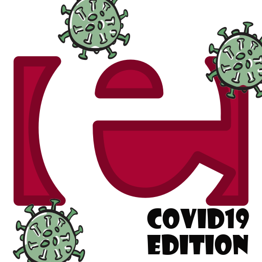

# CovidMonitoring

  

A small project in Erlang to pass the exam of Emerging Programming Paradigms @ University of Bologna

## VERSIONE: 0.3
=======
A small project in Erlang to pass the exam of Emerging Programming Paradigms @ University of Bologna

## VERSIONE: 0.4
>>>>>>> upstream/master

## SCOPO DEL PROGETTO:

   Lo scopo del progetto è quello di realizzare delle "app" (= attori) per il
tracciamento dei contatti fra portatori del virus.

## DESCRIZIONE:

- Ci sono quattro tipi di attori:
  1) gli utenti (o app)
  2) i luoghi che gli utenti visitano
  3) un attore noto (= il cui nome è globalmente registrato) al quale i
     luoghi si registrano e che fornisce agli utenti i PID dei luoghi.
     Lo chiameremo server.
  4) un attore noto, che chiameremo ospedale, che effettua i tamponi agli
     utenti

- Un luogo implementa i seguenti protocolli.
  Può farlo delegando il lavoro ad altri attori da lui creati.
  Tali attori devono essere opportunamente monitorati/linkati per gestire i
  fallimenti.

  * PROTOCOLLO DI INIZIALIZZAZIONE: (al momento della creazione)

      1) si linka al server: nel caso in cui il server muoia tutti gli attori
         in causa devono terminare
      2) comunica al server la propria esistenza

         comunicazione: SERVER ! {new_place, self()}

  * PROTOCOLLO DI VISITA DEI LUOGHI:

      1) mantiene una lista dei visitatori. I visitatori entrano/escono dalla
         lista quando vengono ricevuti i messaggi

         {begin_visit, PID_VISITATORE, REF}
         {end_visit, PID_VISITATORE, REF}

         Le REF devono coincidere.

  * PROTOCOLLO DI RILEVAMENTO DEI CONTATTI:

      1) quando un visitatore entra in lista, a lui e a tutti quelli presenti
         nella lista con probabilità 25% viene inviato un messaggio di contatto
         per sapere con chi sono entrati in contatto. Uno dei due deve essere
         il nuovo arrivato.

         PID1 ! {contact, PID2}

  * CICLO DI VITA

     1) ogni qualvolta un luogo viene visitato ha il 10% di probabilità di
        chiudere, ovvero l'attore termina con successo

- Un utente implementa i seguenti protocolli.
  Può farlo delegando il lavoro ad altri attori da lui creati.
  Tali attori devono essere opportunamente monitorati/linkati per gestire i
  fallimenti.

  * PROTOCOLLO DI MANTENIMENTO DELLA TOPOLOGIA:

      1) si linka al server: nel caso in cui il server muoia tutti gli attori
         in causa devono terminare
      2) cerca di mantenere sempre una lista di tre luoghi attivi
      3) periodicamente (= ogni 10s), nel caso non abbia tre luoghi nella lista,
         contatta il server per ricevere la lista dei PID dei luoghi attivi,
         dai quali ne sceglie casualmente alcuni per arrivare a tre

         richiesta dei luoghi: SERVER ! {get_places, self()}
         risposta: {places, PIDLIST}
      4) monitora i luoghi che ha scelto; nel caso in cui l'attore luogo muoia
         richiede nuovamente al server la lista per integrare causalmente i
         luoghi nella lista riportandoli a tre
     
  * PROTOCOLLO DI VISITA DEI LUOGHI:

      1) ogni 3-5s (scelta casuale) un utente visita uno dei luoghi nella sua
         lista, se ce ne è almeno uno, e prosegue la visita per 5-10s
     
          inizio visita: LUOGO ! {begin_visit, self(), REF}
          fine visita: LUOGO ! {end_visit, self(), REF}

         dove REF è una reference fresca

  * PROTOCOLLO DI RILEVAMENTO DEI CONTATTI:

      1) vanno linkati tutti gli attori con cui l'utente entra in contatto.
         L'entrata in contatto viene notificata come segue

         ricezione messaggio di contatto: {contact, PID}

      2) quando un utente con cui si è entrati in contatto termina tramite
         exit(quarantena) o exit(positivo), anche l'utente deve terminare
         con exit(quarantena) dopo aver stampato "entro in quaratena"

  * PROTOCOLLO DI TEST:

      1) ogni 30s, con probabilità 1/4, l'utente si fa testare come segue

         richiesta di un tampone:  OSPEDALE ! {test_me, self()}
         risposta: positive  o  negative

      2) in caso di risposta positive l'utente stampa "sono positivo" e termina
         con exit(positive); altrimenti stampa "sono negativo"

- l'ospedale implementa i seguenti protocolli

  * PROTOCOLLO DI MANTENIMENTO DELLA TOPOLOGIA:

      1) all'avvio si registra globalmente (con global:register_name())
         usando l'atomo hospital

  * PROTOCOLLO DI TEST:

      1) alla ricezione di un messaggio

         {test_me, PID}

         risponde al PID positive con probabilità 25% e negative altrimenti

- il server implementa i seguenti protocolli

  * PROTOCOLLO DI MANTENIMENTO DELLA TOPOLOGIA:

      1) all'avvio si registra globalmente (con global_register())
         usando l'atomo server

  * PROTOCOLLO DI INIZIALIZZAZIONE:

      1) mantiene una lista dei luoghi attivi; i luoghi vengono aggiunti al
         ricevimento del messaggio

         {new_place, PID_LUOGO}

      2) monitora i luoghi attivi, eliminandoli dalla lista quando questi muoiono

  * PROTOCOLLO DI MANTENIMENTO DELLA TOPOLOGIA:

      1) risponde alle richieste di conoscenza sui luoghi:

         alla ricezione di: {get_places, PID}
         risponde con: PID ! {places, PIDLIST}
